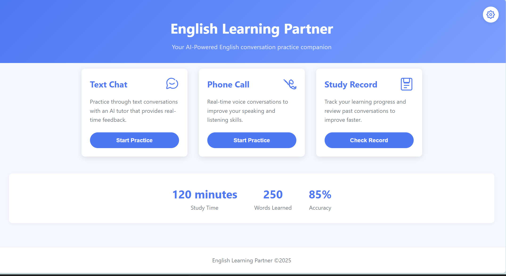
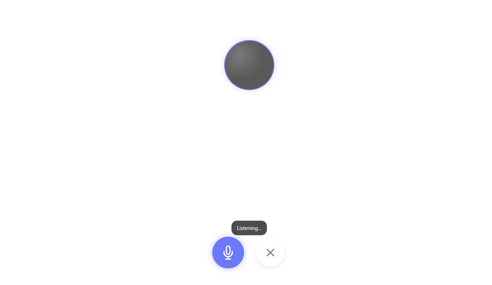
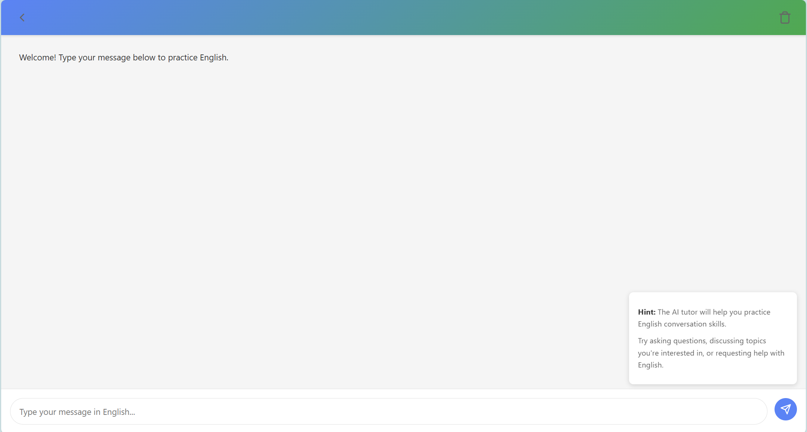
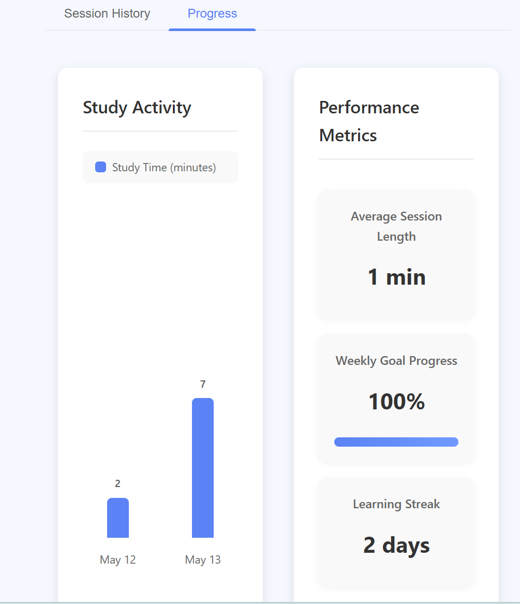
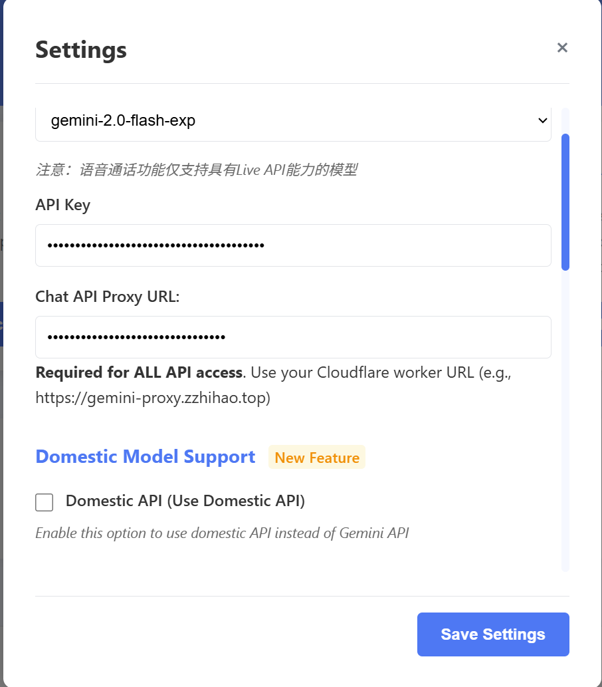

# 英语 AI 辅导项目 (English Tutor AI Project)

## 简介 (Introduction)

本项目是一款面向英语学习者的 Web 应用，主要基于 Google Gemini API 构建，旨在提供多种互动模式帮助用户提升英语听说、阅读和写作能力。

- 实时语音对话：用户可通过麦克风与 AI 进行流畅的口语练习，支持语音识别 (STT) 与语音合成 (TTS)。
- 文本聊天模式：用户可通过文本与 AI 对话，并由浏览器或云端合成自然语音朗读回答，隐藏文字以强化听力学习。
- 学习记录与分析：自动保存会话，提取关键词与生词，并生成学习报告和图表，帮助用户追踪进度。
- 配置管理：通过设置界面可配置 API 密钥、代理地址、模型参数等。



## 项目文件结构和用途 (Project Structure & Purpose)

```
tutor/
├── index.html              主页（主入口）
├── pages/                  前端页面（chat.html、call.html、record.html 等）
├── js/                     所有 JS 功能模块，包含以下子模块：
│   ├── audio-tools/        客户端音频录制与处理工具（如音频录制、可视化、流处理等）
│   ├── core/               核心模块（如双向音频流代理、客户端封装、应用配置等）
│   ├── features/           主要功能实现（如文本聊天、语音对话、学习记录与分析等）
│   ├── settings/           设置页面逻辑与配置服务
│   └── utils/              通用工具函数（如网络请求、音频处理、WebSocket 工具等）
├── styles/                 界面样式（CSS 文件）
├── assets/                 静态资源 (图标、图片等)
├── .env                    环境变量 (API 密钥、代理 URL 等)
├── LICENSE                 许可证
└── 项目介绍.md             项目介绍文档
```

## 功能 (Features)

### 实时语音对话

- 支持用户通过麦克风与 AI 进行自然流畅的英语口语练习。
- 实现了高灵敏度的语音活动检测（VAD），自动检测说话起止，自动分段。
- 录音数据实时通过 WebSocket 发送到 Gemini API，AI 实时返回语音回复并自动播放。
- 支持长时间会话、自动处理静音、断线重连、AI 主动 check-in 等健壮机制。
- AI 回复采用高质量 TTS 合成，支持多种声音和语速自定义。
- 会话结束后可保存语音记录，自动生成主题总结与语言反馈。



### 文本聊天模式

- 支持与 AI 进行纯文本对话，适合练习写作和阅读。
- AI 回复自动朗读（TTS），可选择 Gemini 云端语音或浏览器本地语音。
- AI 回复文字默认隐藏，需多次重播后可解锁显示，强化听力训练。
- 支持消息重播、显示隐藏文字、自动统计用户回合数。
- 聊天历史可保存为学习记录，自动生成主题总结与详细语言反馈。
- 支持多模型切换（Gemini/ECNU 模型），自动检测并切换可用服务。

  

### 学习记录与分析

- 自动保存每次会话（语音/文本），记录日期、时长、主题、反馈等。
- 支持按类型/日期筛选、统计总学习时长、会话次数、平均时长、学习周目标、连续学习天数等。
- 自动提取关键词和生词，生成个人词汇表，支持搜索和按频率排序。
- 生成近 7 天学习进度柱状图，直观展示学习活跃度。
- 每条记录自动生成主题总结和三维度（流利度、词汇、表达清晰度）详细反馈。
- 支持一键导出全部学习数据为 JSON 文件，便于备份和迁移。
  

### 配置与个性化

- 支持在设置页自定义 API Key、代理服务器、模型类型、语速、声音类型、最大 Token 数等参数。
- 配置变更即时生效，无需重启。
- 支持多模型和多语音引擎切换，兼容性强。
  

### 稳定性与用户体验

- 前端页面支持自动刷新、断线重连、异常提示、操作引导。
- 语音和文本会话均支持保存、回放、详细反馈和个性化设置。
- 代码结构模块化，便于扩展和维护。

## 运行方法 (Running Instructions)

### 依赖 (Dependencies)

- Node.js (推荐 LTS 版本，如 18.x)
- npm 或 yarn
- 现代 Web 浏览器 (Chrome/Firefox/Edge)

### 本地启动 (Local Setup)

1. 安装依赖：

   - Node.js (推荐 LTS 版本，如 18.x)
   - 现代 Web 浏览器 (Chrome/Firefox/Edge)
   - Visual Studio Code 编辑器
   - VS Code 插件：Live Server

2. 打开项目：

   - 用 VS Code 打开 tutor 目录。

3. 启动本地服务器：

   - 在 VS Code 资源管理器中，展开 `pages/` 文件夹。
   - 右键点击你想预览的 HTML 文件（如 `index.html`、`chat.html` 等），选择 "Open with Live Server" 或 "在 Live Server 中打开"。
   - 浏览器会自动打开对应页面（如 http://127.0.0.1:5500/pages/index.html）。
   - 修改 HTML/CSS/JS 文件后，页面会自动刷新。

4. （可选）如需后端或 API 支持，请根据实际需求启动相关服务。

5. 在 settings.js 中配置 .env 中内容（仅供测试使用）。
